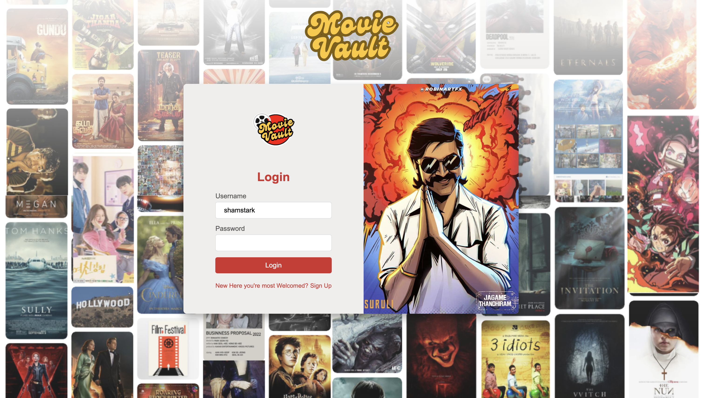
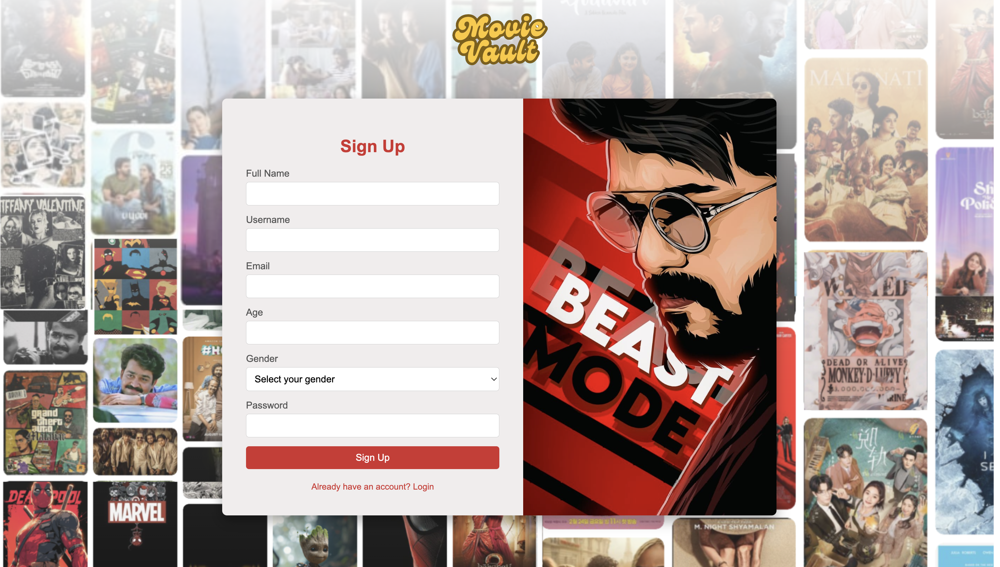
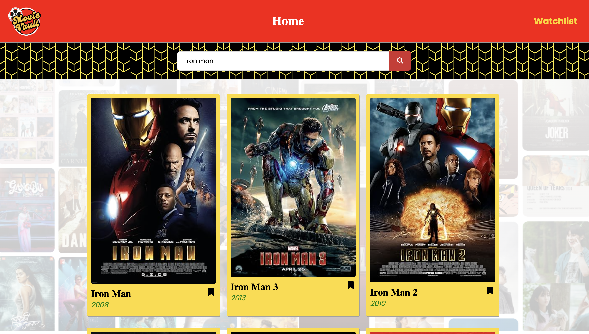
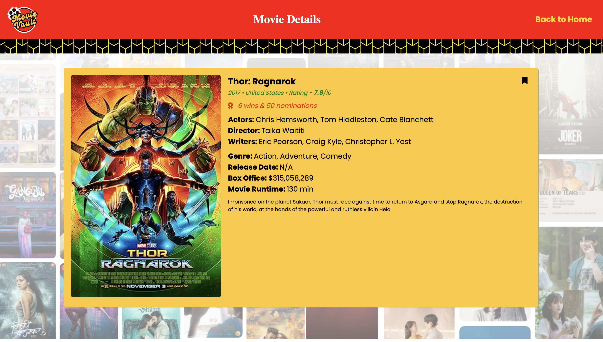
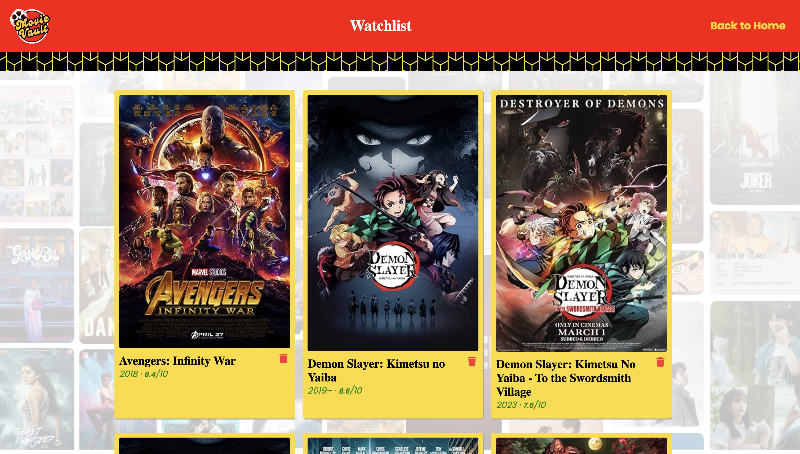

# 🎬 Movie Vault - Shamprakash R

> A dynamic and user-friendly movie database web application.

---

## 🔍 Core Features

- 🔎 **Home Page:** Search bar to find movies by title.
- 🎞 **Movie Results:** View a list of matching movies.
- 📃 **Movie Details:** Get cast, plot, and ratings for a selected movie.
- 📝 **Watchlist:** Add and manage your personal watchlist.
- 🔐 **Authentication:** Login and Sign-up features with credential verification.

---

## 🧰 Tech Stack

### 🔹 Frontend
- HTML
- CSS
- JavaScript (DOM Manipulation + Fetch API)

### 🔹 Backend
- Node.js
- Express.js
- Axios (for API calls to OMDB)

### 🔹 Database
- MongoDB (for storing user credentials)

---

## 🔌 API Integration
Used **OMDB API** to fetch live movie data for search results and details pages.

---

## 🌐 Hosting
Hosted on **Render**  
🔗 [Live Website](https://shamprakash-moviedb.onrender.com/)

---

## 📷 Project Screenshots

> ⚠️ **Replace each image placeholder with your own screenshot later.**

### 🔑 Login Page
 <!-- Replace with your screenshot -->

### 📝 Sign Up Page
 <!-- Replace with your screenshot -->

### 🏠 Landing/Search Page
 <!-- Replace with your screenshot -->

### 🎥 Movie Details Page
 <!-- Replace with your screenshot -->

### ⭐ Watchlist Page

.png) <!-- Replace with your screenshot -->

---

## 🚀 Run Locally

Clone the project

```bash
git clone https://github.com/Shamprakash1609/Shamprakash-MovieDB.git
